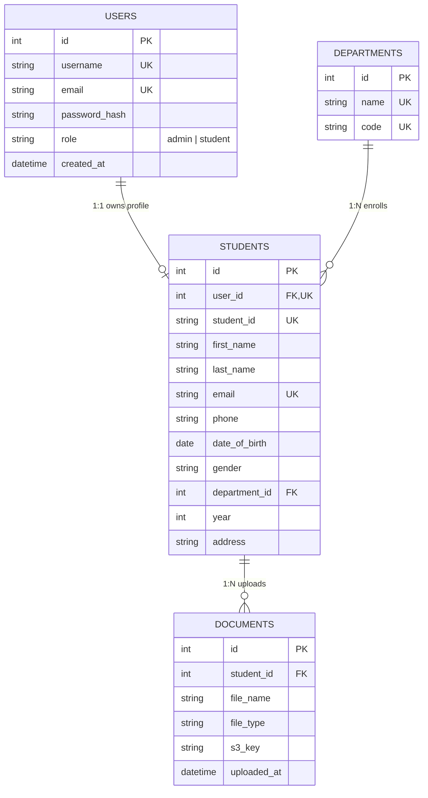
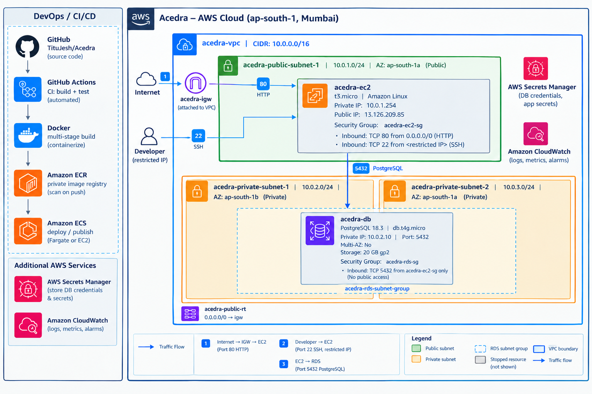

<div align="center">

  <h1 align="center"> Acedra</h1>

  <p align="center">
    <strong>Production-ready, cloud-native Student Information & Cloud Document Management System.</strong>
  </p>

  <p align="center">
    Built with Python 3.12, FastAPI, PostgreSQL 16, SQLAlchemy 2.0, Alembic, AWS S3, and AWS Secrets Manager.
  </p>

  <p align="center">
    <a href="https://github.com/TituJesh/Acedra/blob/main/LICENSE">
      
    </a>
    
    
    
    
    
    
    
    
    
    
    
  </p>

</div>

---

## Table of Contents

- [Overview](#overview)
- [Key Features](#key-features)
- [Tech Stack](#tech-stack)
- [Database Schema (ERD)](#database-schema-erd)
- [Quickstart & Local Development](#quickstart--local-development)
- [Role-Based Access Control (RBAC)](#role-based-access-control-rbac)
- [API Endpoints](#api-endpoints)
- [AWS Cloud Architecture](#aws-cloud-architecture)
- [Testing & Quality Assurance](#testing--quality-assurance)
- [Security Highlights](#security-highlights)
- [Production Cloud Deployment](#production-cloud-deployment)
- [Support](#support)
- [License & Author](#license--author)

---

## Overview

**Acedra** is an enterprise-grade Student Information & Cloud Document Management RESTful API backend engineered for academic institutions, universities, and departmental faculties.

The application features an asynchronous **FastAPI** REST gateway with OAuth2 authentication and granular RBAC, **SQLAlchemy 2.0** ORM for relational persistence on **PostgreSQL 16**, **Alembic** schema migrations, **Amazon S3** for secure multi-tenant document storage with short-lived presigned URLs, and **AWS Secrets Manager** for zero-trust cryptographic key management.

---

## Key Features

- **RESTful Architecture**: Clean, modular API routes across Authentication, Students, Departments, and Documents.
- **Role-Based Access Control**: Strict segregation between `admin` and `student` roles, preventing unauthorized cross-tenant data access.
- **Secure Document Vault**: Multi-tenant file storage streaming to private Amazon S3 with time-limited (300s TTL) HMAC presigned download URLs.
- **Zero Hardcoded Secrets**: Automatic dual-mode configuration (local `.env` for dev, AWS Secrets Manager for production).
- **Relational Integrity**: PostgreSQL 16 schema backed by SQLAlchemy 2.0 ORM with automated, reversible Alembic migrations.
- **Auto-Generated Docs**: Interactive OpenAPI 3.0 documentation via Swagger UI (`/docs`) and ReDoc (`/redoc`).

---

## Tech Stack

- **Backend Framework**: Python 3.12, FastAPI, Pydantic v2
- **ASGI Server**: Uvicorn (worker clustering with Gunicorn for production)
- **Database & Driver**: PostgreSQL 16, Psycopg 3 (`psycopg[binary]`)
- **ORM & Migrations**: SQLAlchemy 2.0, Alembic
- **Cloud Storage & Security**: AWS S3 (`boto3`), AWS Secrets Manager
- **Authentication**: JWT (HS256 via Python-Jose), native Bcrypt password hashing
- **DevOps & IaC**: Docker, Amazon ECR, GitHub Actions (OIDC), Terraform, AWS CloudFormation

---

## Database Schema (ERD)


```mermaid
erDiagram
    USERS ||--o| STUDENTS : "1:1 owns profile"
    DEPARTMENTS ||--o{ STUDENTS : "1:N enrolls"
    STUDENTS ||--o{ DOCUMENTS : "1:N uploads"

    USERS {
        int id PK
        string username UK
        string email UK
        string password_hash
        string role "admin | student"
        datetime created_at
    }

    DEPARTMENTS {
        int id PK
        string name UK
        string code UK
    }

    STUDENTS {
        int id PK
        int user_id FK, UK
        string student_id UK
        string first_name
        string last_name
        string email UK
        string phone
        date date_of_birth
        string gender
        int department_id FK
        int year
        string address
    }

    DOCUMENTS {
        int id PK
        int student_id FK
        string file_name
        string file_type
        string s3_key
        datetime uploaded_at
    }
```

---

## Quickstart & Local Development

### 1. Clone & Set Up Virtual Environment

```bash
git clone https://github.com/TituJesh/Acedra.git
cd Acedra

# Create and activate virtual environment
python -m venv venv
# Linux / macOS: source venv/bin/activate
# Windows PowerShell: .\venv\Scripts\Activate.ps1

# Install dependencies
pip install --upgrade pip
pip install -r requirements.txt
```

### 2. Configure Environment

Copy the example configuration file:
```bash
cp .env.example .env
```
Update `.env` with your PostgreSQL connection URL and AWS credentials (see [`.env.example`](.env.example) for details).

### 3. Run Migrations & Start Server

```bash
# Apply database migrations
alembic upgrade head

# Start local development server
uvicorn app.main:app --reload --host 127.0.0.1 --port 8000
```
- **API Base URL**: `http://127.0.0.1:8000`
- **Interactive Swagger UI**: `http://127.0.0.1:8000/docs`
- **ReDoc Documentation**: `http://127.0.0.1:8000/redoc`

---

## Role-Based Access Control (RBAC)

Acedra enforces strict principle-of-least-privilege authorization across three access tiers:

| Tier | Role Scope & Permissions | Key Operations |
| :--- | :--- | :--- |
| **Public** | Unauthenticated visitors | Account registration (`/auth/register`), login (`/auth/login`), API docs (`/docs`), health check (`/health`) |
| **Student** | Self-service student operations | View own profile (`/students/me`, `/auth/me`), change password, browse departments, view & download own documents |
| **Admin** | Full academic & administrative control | Student & department CRUD, document upload/deletion, student search, aggregate demographics & stats |

> 🔒 **Tenancy Isolation**: Ownership is enforced at the service level. A student attempting to access or download another student's record or documents receives an immediate `403 Forbidden`.

---

## API Endpoints

Interactive documentation and real-time schema testing are available via Swagger UI at [`/docs`](http://127.0.0.1:8000/docs) or ReDoc at [`/redoc`](http://127.0.0.1:8000/redoc).

| Module | Methods & Routes | Description | Access |
| :--- | :--- | :--- | :--- |
| **Auth** | `POST` `/auth/register`, `/login`, `/change-password`<br>`GET` `/auth/me` | User registration, JWT token generation, password rotation, identity lookup | Public / Authenticated |
| **Students** | `GET, POST` `/students/`<br>`GET` `/students/me`, `/search`, `/stats/summary`<br>`GET, PUT, DELETE` `/students/{id}` | Directory listing (filters: `dept`, `year`, `gender`), demographics, search, profile CRUD | Authenticated (Admin write) |
| **Departments** | `GET, POST` `/departments/`<br>`GET, PUT, DELETE` `/departments/{id}` | Academic department catalog, enrollment-guarded deletions, updates | Authenticated (Admin write) |
| **Documents** | `POST` `/documents/upload/{id}`<br>`GET` `/documents/student/{id}`, `/{id}`<br>`GET` `/documents/{id}/download`<br>`DELETE` `/documents/{id}` | Private S3 uploads (10MB limit), metadata browsing, time-limited presigned URLs (300s TTL), deletion | Owner / Admin |

---

## AWS Cloud Architecture

<p align="center">
  
</p>

Acedra is deployed in **AWS Asia Pacific (Mumbai) `ap-south-1`** using an isolated VPC network topology with strict security boundaries:

- **CI/CD Pipeline**: GitHub Actions builds and tests multi-stage Docker images, pushing to private **Amazon ECR** with automated vulnerability scanning on push.
- **Compute (`acedra-ec2`)**: `t3.micro` instance in Public Subnet (`ap-south-1a`, `10.0.1.0/24`) behind `acedra-igw` (Port 80 HTTP, Port 22 SSH restricted to developer IP).
- **Database (`acedra-db`)**: Managed PostgreSQL 18.3 on **Amazon RDS** (`db.t4g.micro`, 20GB gp2) isolated in Private Subnet (`ap-south-1b`, `10.0.2.0/24`), accessible strictly from `acedra-ec2-sg` on port 5432.
- **Storage & Observability**: **Amazon S3** private document vault (HMAC presigned URLs), **AWS Secrets Manager** for zero-trust runtime credential injection, and **Amazon CloudWatch** for centralized logging and alarms.
- **IaC Provisioning**: Automated deployment templates via [Terraform](infra/terraform/) or [CloudFormation](infra/cloudformation/ecr-oidc.yaml). Refer to the [AWS Setup Guide](docs/aws-ecr-oidc-setup.md).

---

## Testing & Quality Assurance

The test suite runs against an isolated SQLite in-memory database with fully mocked AWS S3 services:

```bash
# Run pytest test suite
pytest -v

# Run with test coverage
pytest --cov=app --cov-report=term-missing
```

---

## Security Highlights

- **Zero Hardcoded Secrets**: Environment-driven secret injection (`.env` in local, AWS Secrets Manager in production).
- **Cryptographic Password Hashing**: Passwords hashed with salt using native `bcrypt`.
- **Private Object Storage**: No public S3 bucket access; retrieval is mediated via short-lived HMAC presigned URLs.
- **Cross-Tenant Isolation**: Ownership verification guards student records and files against unauthorized access (`403 Forbidden`).
- **Input Sanitization & SQL Safety**: Pydantic v2 data contract validation and SQLAlchemy 2.0 parameterized queries eliminate SQL injection risks.

---

## Production Cloud Deployment

```bash
# Production command with Gunicorn and Uvicorn workers:
gunicorn -w 4 -k uvicorn.workers.UvicornWorker app.main:app --bind 0.0.0.0:8000
```

- **Container Image**: Built via multi-stage [Dockerfile](Dockerfile) with an unprivileged non-root user (`appuser`).
- **CI / CD Pipeline**: Automated GitHub Actions testing, Docker builds, and keyless ECR publishing on every push to `main`.

---

## Support

If you find this project useful, please consider giving it a ⭐ star on [GitHub](https://github.com/TituJesh/Acedra) — it helps support the project!

---

## License & Author

Distributed under the **MIT License**. See [LICENSE](LICENSE) for details.

Developed by **[TituJesh](https://github.com/TituJesh)**.
