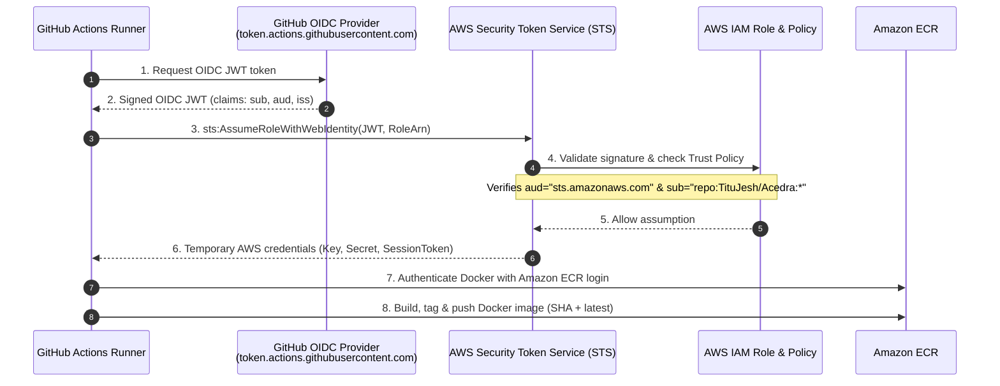

# AWS ECR & GitHub Actions OIDC Integration Guide

This guide walks you through connecting this repository (`TituJesh/Acedra`) to **Amazon Elastic Container Registry (ECR)** using **OpenID Connect (OIDC)**.

---

## 1. Why OIDC Instead of Long-Lived IAM Keys?

| Feature | Traditional AWS Access Keys | GitHub Actions OIDC |
| :--- | :--- | :--- |
| **Credentials** | Long-lived static secret keys stored in GitHub Secrets | Short-lived, temporary STS tokens (valid for ~1 hour) |
| **Leak Risk** | High (if key is copied or leaked, AWS account is compromised) | None (tokens cannot be reused outside the specific GitHub runner) |
| **Rotation** | Manual rotation required every 90 days | Zero maintenance; generated & destroyed per job |
| **Scoping** | Account/user scoped | Scoped to exact GitHub Org, Repo, and Branch |

---

## 2. Architecture & OIDC Handshake Flow



---

## 3. Provisioning AWS Resources (Choose ONE Method)

We have prepared automated templates and scripts so you can set up everything in under 2 minutes.

### Method A: One-Command Automated Script (Recommended)

#### On Windows (PowerShell):
```powershell
# Run the PowerShell setup script
.\scripts\setup-aws-oidc-ecr.ps1 -AwsRegion "ap-south-1" -GitHubRepo "TituJesh/Acedra"
```

#### On Linux / macOS / AWS CloudShell (Bash):
```bash
chmod +x ./scripts/setup-aws-oidc-ecr.sh
./scripts/setup-aws-oidc-ecr.sh
```

---

### Method B: Terraform

If you prefer Infrastructure as Code (IaC):

```bash
cd infra/terraform

# Initialize Terraform AWS provider
terraform init

# Review execution plan
terraform plan

# Apply and create resources
terraform apply
```

Terraform outputs will display your `github_actions_role_arn` and `ecr_repository_url`.

---

### Method C: CloudFormation / AWS Console

1. Open the [AWS CloudFormation Console](https://console.aws.amazon.com/cloudformation).
2. Choose **Create stack** > **With new resources (standard)**.
3. Select **Upload a template file** and choose [`infra/cloudformation/ecr-oidc.yaml`](file:///e:/Acedra/infra/cloudformation/ecr-oidc.yaml).
4. Enter parameters:
   - **Stack name**: `acedra-ecr-oidc`
   - **GitHubOrg**: `TituJesh`
   - **GitHubRepo**: `Acedra`
   - **EcrRepositoryName**: `acedra-backend`
   - **CreateOidcProvider**: `true` (set `false` only if you already registered GitHub OIDC previously)
5. Acknowledge the IAM capability checkbox and click **Submit**.
6. Check the **Outputs** tab once completed to find the `RoleArn`.

---

### Method D: Manual AWS Console Setup (Step-by-Step)

If you wish to configure everything manually by hand in the AWS Console:

#### Step 1: Add GitHub as an Identity Provider in IAM
1. Go to **AWS IAM Console** > **Identity providers** > **Add provider**.
2. Provider type: **OpenID Connect**.
3. Provider URL: `https://token.actions.githubusercontent.com`
4. Audience: `sts.amazonaws.com`
5. Click **Get thumbprint**, then click **Add provider**.

#### Step 2: Create Amazon ECR Repository
1. Go to **Amazon ECR Console** > **Repositories** > **Create repository**.
2. Visibility: **Private**.
3. Repository name: `acedra-backend`.
4. Tag immutability: **Mutable** (allows `latest` tag updates).
5. Scan on push: **Enabled** (for automated security vulnerability scans).
6. Click **Create repository**.

#### Step 3: Create IAM Role for GitHub Actions
1. Go to **IAM Console** > **Roles** > **Create role**.
2. Trusted entity type: **Web identity**.
3. Identity provider: `token.actions.githubusercontent.com`.
4. Audience: `sts.amazonaws.com`.
5. GitHub organization: `TituJesh`.
6. GitHub repository: `Acedra`.
7. Role name: `AcedraGitHubActionsECRRole`.
8. Attach an inline policy with the contents of [`infra/iam/ecr-permissions-policy.json`](file:///e:/Acedra/infra/iam/ecr-permissions-policy.json) (replace `ACCOUNT_ID` and `REGION`).

---

## 4. GitHub Repository Configuration

Once your AWS IAM Role is created, configure GitHub Actions:

1. Open your repository on GitHub: `https://github.com/TituJesh/Acedra/settings/secrets/actions`
2. **Repository Secret**:
   - Click **New repository secret**.
   - **Name**: `AWS_ROLE_ARN`
   - **Secret**: `arn:aws:iam::<YOUR_ACCOUNT_ID>:role/AcedraGitHubActionsECRRole`
3. **Repository Variables** (Optional, under **Variables** tab):
   - `AWS_REGION`: `ap-south-1` (defaults to `ap-south-1` if not set)
   - `ECR_REPOSITORY`: `acedra-backend` (defaults to `acedra-backend` if not set)

---

## 5. How the CI/CD Pipeline Operates

The workflow file is located at [`.github/workflows/ci.yml`](file:///e:/Acedra/.github/workflows/ci.yml).

- **On Pull Requests**:
  - Runs full `pytest` test suite.
  - Builds the Docker image locally to validate syntax and dependencies without deploying.
- **On Push to `main` (or manual `workflow_dispatch`)**:
  - Runs tests.
  - Checks if `AWS_ROLE_ARN` is configured (gracefully skips with an actionable warning if not).
  - Assumes AWS IAM role via OIDC token.
  - Logs into Amazon ECR.
  - Builds Docker image with multi-layer GitHub Actions cache (`type=gha`).
  - Tags with both `latest` and commit SHA `${{ github.sha }}`.
  - Pushes both tags to ECR.
  - Outputs a Markdown summary table into the GitHub Actions run summary.

---

## 6. Verification & Testing

1. Go to the **Actions** tab in GitHub (`https://github.com/TituJesh/Acedra/actions`).
2. Select **Acedra CI / CD Pipeline**.
3. Click **Run workflow** (via `workflow_dispatch`) or push a commit to `main`.
4. Verify the job completes and check the GitHub Step Summary.
5. In AWS, inspect your new image:
   ```bash
   aws ecr list-images --repository-name acedra-backend --region ap-south-1
   ```

---

## 7. Security Hardening & Troubleshooting

### Error: `AssumeRoleWithWebIdentity: Not authorized to perform sts:AssumeRoleWithWebIdentity`
- **Cause**: The `sub` condition in your IAM Role Trust Policy does not match the GitHub context.
- **Fix**: Check [`infra/iam/trust-policy.json`](file:///e:/Acedra/infra/iam/trust-policy.json). Ensure the condition allows:
  ```json
  "token.actions.githubusercontent.com:sub": "repo:TituJesh/Acedra:*"
  ```
  If your repository was renamed or transferred, update the name accordingly.

### Error: `permissions: id-token: write` missing
- In GitHub Actions, OIDC tokens require explicit permissions in the workflow:
  ```yaml
  permissions:
    id-token: write
    contents: read
  ```
  This is already included in [`.github/workflows/ci.yml`](file:///e:/Acedra/.github/workflows/ci.yml).

### Strict Branch Restriction (Optional)
If you want to allow **only** the `main` branch to assume the role (blocking feature branches or other triggers):
```json
"token.actions.githubusercontent.com:sub": "repo:TituJesh/Acedra:ref:refs/heads/main"
```
